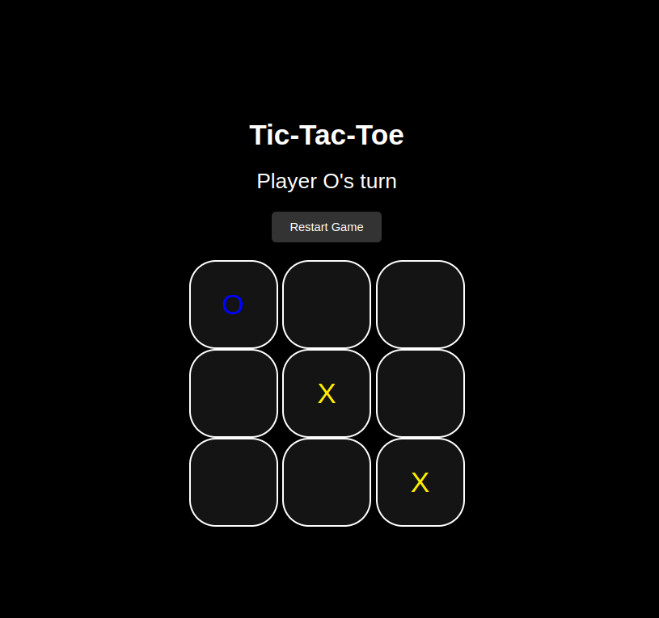

# Tic-Tac-Toe Game

A simple and interactive Tic-Tac-Toe game built using **HTML**, **CSS**, and **JavaScript**. This project is designed to be a fun and engaging way to learn the basics of web development.

## Preview:


<br>

## Table of Contents
- [Demo]()
- [License](./LICENSE)

## Demo
You can play the game [here](https://tic-tac-toe-game-eldodev.vercel.app/)

## Features
- **Interactive gameplay**: Players take turns.
- **Responsive design for all screen sizes.

## Installation
To install, follow these steps:

1. Clone the repository:
   ```bash
   ```bash
   git clone https://github.com/eldoJr/tic-tac-toe-game.git